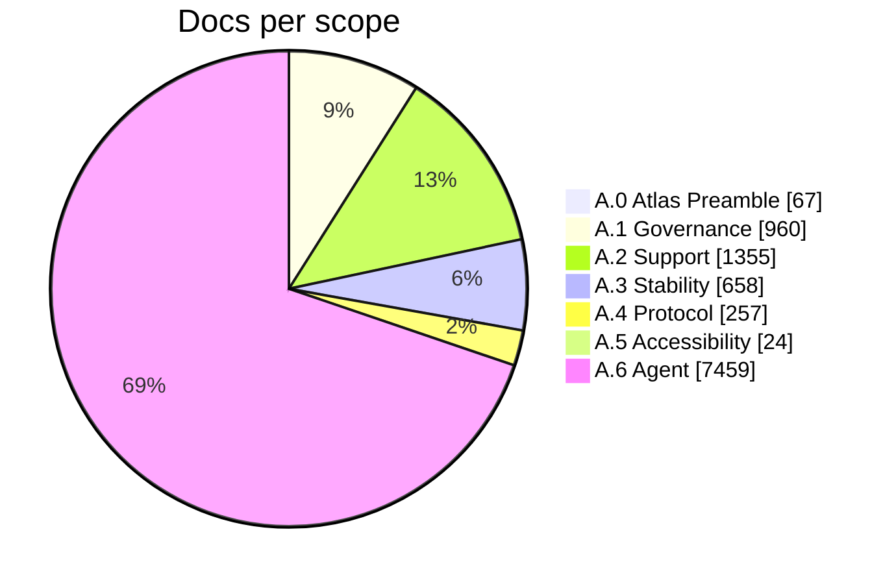

# The Shape of the Atlas

> Generated by `scripts/aux/atlas-shape.mjs` at atlas commit `db87434` — regenerate, don't hand-edit.

Total: **10780 docs**, 2184 KB of content, 81 glossary terms.

## Doc mass by scope

| Scope | Docs | Content | |
|---|---:|---:|---|
| A.0 Atlas Preamble | 67 | 28 KB | `█` |
| A.1 The Governance Scope | 960 | 440 KB | `████` |
| A.2 The Support Scope | 1355 | 390 KB | `█████` |
| A.3 The Stability Scope | 658 | 195 KB | `██` |
| A.4 The Protocol Scope | 257 | 56 KB | `█` |
| A.5 The Accessibility Scope | 24 | 4 KB | `█` |
| A.6 The Agent Scope | 7459 | 1070 KB | `████████████████████████████` |

## Doc mass by chunk group

Groups per the taxonomy in `docs/atlas-map.md` §2 (tree-based groups only; overlays below).

| Group | Docs | Content | |
|---|---:|---:|---|
| Constitutional core | 241 | 116 KB | `█` |
| Actor rulebooks | 165 | 86 KB | `█` |
| Governance processes | 620 | 267 KB | `██` |
| Primitive spec library | 723 | 204 KB | `███` |
| Support processes | 631 | 187 KB | `██` |
| Financial machinery | 658 | 195 KB | `██` |
| Protocol machinery | 257 | 56 KB | `█` |
| Accessibility | 24 | 4 KB | `█` |
| Agent artifacts | 7459 | 1070 KB | `████████████████████████████` |

## Agent artifact weights

| Artifact | Docs | Content | |
|---|---:|---:|---|
| Spark | 2284 | 331 KB | `████████████████████████████` |
| Grove | 1793 | 207 KB | `██████████████████████` |
| Keel | 906 | 140 KB | `███████████` |
| Skybase | 710 | 109 KB | `█████████` |
| Obex | 499 | 90 KB | `██████` |
| Pattern | 478 | 86 KB | `██████` |
| Osero | 436 | 60 KB | `█████` |
| Launch Agent 7 | 340 | 45 KB | `████` |
| Operational Executor Agent Amatsu | 3 | 0 KB | `█` |
| Operational Executor Agent Ozone | 3 | 0 KB | `█` |
| Core Council Executor Agent 1 | 3 | 0 KB | `█` |

## Overlay chunks (doc types crossing the tree)

| Type | Count |
|---|---:|
| Core | 10319 |
| Section | 118 |
| Active Data | 76 |
| Annotation | 68 |
| Active Data Controller | 64 |
| Article | 47 |
| Action Tenet | 30 |
| Type Specification | 30 |
| Needed Research | 12 |
| Scope | 7 |
| Scenario | 6 |
| Scenario Variation | 3 |

